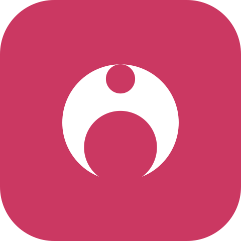
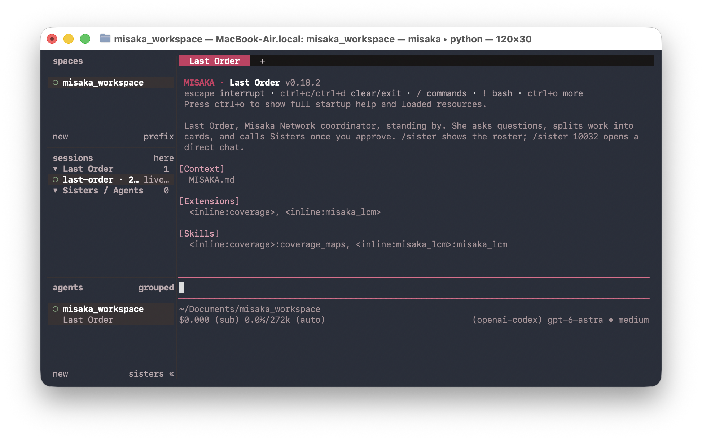
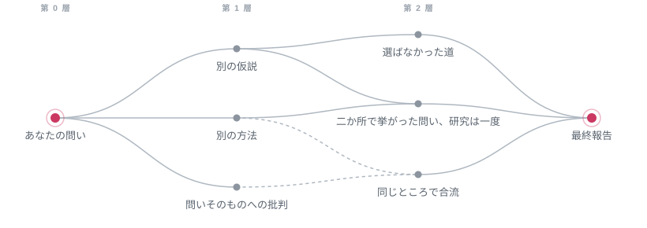

<h1 align="center">
  <br>
  MISAKA
</h1>

<p align="center"><strong>DAG と徴候的読解を組み合わせ、多元的な物語を掘り起こす、人文・社会科学研究に特化した AI エージェント・アーキテクチャ。</strong></p>

<p align="center"><em>現前より大切なのは不在なんだから！ってミサカはミサカはあなたの頭をこつんと叩いてみたり。</em></p>

<p align="center">
  <a href="LICENSE"></a>
  
  
</p>

<p align="center"><a href="README.md">English</a> · <a href="README.zh-CN.md">简体中文</a> · 日本語</p>

取りまとめ役の **Last Order**（打ち止め）と一緒に問いを分解して研究計画を練り上げ、研究の各分野の調査を、報告・連絡・相談の得意な **Sisters**（妹達）に割り振ります。専門家たちの調査報告をまとめて読み込み、執筆し、審査員の前で答弁を終え、結論が覆いきれない方向を新しい研究に変えます。研究の枝のグラフはグラフ理論のアルゴリズムで管理され、最終報告は研究論文としてプロジェクトフォルダに保存され、すべての引用をたどることができます。

<p align="center">
  
</p>

<table>
<tr><td><b>資料が戻るまで結論を出さない</b></td><td>専門家が資料を持ち帰るまで、Last Order は問いに結論を下しません。問いを下位の問いと前提となる問いに分け、それらが互いにどう関わり合うかを整理するだけです。見解は資料から育ち、最終報告も研究がたどり着いた論点を編み上げるので、主流と食い違う見解が削り落とされることはありません。</td></tr>
<tr><td><b>専門家はそれぞれの術で</b></td><td>Sister はそれぞれの専門、スキル、モデル（Claude、GPT、Gemini、手元のマシンのモデル）を携えて自分の分野を掘り下げます。Claude Code や Codex もチームに加わってカードを受け持ちます。Last Order は道具の使い方に気を配らずにすみ、コンテキストを専門家の持ち帰った資料のために空けておけます。手段を思わずして、目的に専心する。</td></tr>
<tr><td><b>徴候的読解</b></td><td>レッドチームの Sister は事実と推論を確かめるだけでなく、Last Order の思考過程を読み、結論が口にしないまま論証を支えている箇所を探します。続く分岐レビューが、こうした不在を二つに分けます。その線が自分で補える見落としはそのノードの中で埋め、その前提ゆえに視野の外に置かれた方向は Last Order に回り、新しい研究として開くか、開かない理由を記録します。アルチュセールが徴候的読解で区別した二つの「見えなさ」、すなわち見落としと、問題構成がそもそも見せないものです。</td></tr>
<tr><td><b>可能性のグラフ</b></td><td>新しい方向はそれぞれ Last Order の会話から分岐し、それまでの思考をすべて引き継いで、専用のチームとレッドチームを持つノードになります。グラフは一層ずつ育ちます。同じ可能性を二度開くことはなく、二つの線が挙げた問いは一度だけ研究し、同じところにたどり着いた線は合流させ、統合できるものは統合し、できないものは対立点をはっきり線引きします。</td></tr>
<tr><td><b>問いそのものが誤っていることもある</b></td><td>研究は、問いが概念の混乱やイデオロギー的な前提の上に立っていて、そのままでは成り立たないと結論することがあります。これは研究の正当な結果です。変わるのがあなたの問いなら、Last Order はまずあなたの同意を求めます。</td></tr>
<tr><td><b>常識の外側へ</b></td><td>一問一答では、モデルは自分がいちばんよく口にすることを答えがちです。どの計画にも網羅表が付き、空欄はあらかじめ宣言された欠落です。網羅マップは各分野が自分の文献に用いる分類体系から作られ、文献スキャンで問いが研究史のどこに位置するかがわかります。</td></tr>
<tr><td><b>すべてたどれる</b></td><td>引用はページまでたどれます。PageIndex が長い文書に目次を作るので、エージェントは本を章ごとに読み、印刷されたページで引用し、引用が何ページにあるかを突き止めます。スキャン画像は英語・中国語・日本語で OCR し、DjVu も読めます。記憶は元の言葉までたどれます。会話がモデルの容量を超えるとロスレス・コンテキスト管理（LCM）が要約し、どの要約も原文に戻れます。プロジェクトのどのエージェントも同じ記憶を検索します。</td></tr>
<tr><td><b>検証できる研究の記録</b></td><td>計画、カード、結論のすべての版、批評、出典の一覧は、プロジェクト内の Markdown ファイルで、プロジェクトは git リポジトリです。MISAKA はあなたが求め、ファイルを確かめたときにだけコミットするので、批判を受けて議論がどう変わったかが履歴に残ります。</td></tr>
<tr><td><b>舵を取るのはあなた</b></td><td>どの計画もあなたの了承を待ちます。了承はふつうに会話するだけです。枝ごとにパネルのタブがあり、どのエージェントにもそのペインから話しかけられます。研究は止めて、後から再開できます。</td></tr>
</table>

## クイックスタート

```sh
uv tool install "misaka[providers] @ git+https://github.com/Luciole-Studio/Misaka-Agent.git"

mkdir my-research
cd my-research
misaka setup     # サインイン、モデル選択、最初の二人の Sister を作成
misaka           # MISAKA を開いて /research と入力
```

必要なもの：macOS、Linux、または Windows（x86_64 / arm64）と [uv](https://docs.astral.sh/uv/)、git、[ripgrep](https://github.com/BurntSushi/ripgrep)、[fd](https://github.com/sharkdp/fd)、poppler、そしてモデルのプロバイダ（API キー、または ChatGPT や GitHub Copilot のサブスクリプション）。Claude のアカウントでもサインインできますが、その利用は Anthropic によってトークン単位の追加利用として課金されます。インストールはこのリポジトリから行ってください。PyPI の `misaka` は無関係のパッケージです。

[はじめに](docs/getting-started.ja.md)では、各手順と最初の研究の問いまでを順に案内しています。

## 研究の進み方

> *計画ができたよ！あなたが「いいよ」って言ったらすぐ始めるから！ってミサカはミサカは計画書を両手で差し出してみたり。*

一回の研究は、さまざまな可能性から育つグラフです。あなたの問いが最初のノードになり、結論が選ばなかった可能性の一つひとつが、一層ずつその下のノードに育ちます。

<p align="center">
  
</p>

1. **どのノードも一つの研究です。** Last Order があなたと計画を話し合い、了承を得てから始めます。資料が戻るまで、彼女は問いを分解するだけで結論を出しません。Sisters はカードを並行して進め、発見をひとつずつ出典とともに記録し、Last Order はそれを読んでから結論を書きます。
2. **レッドチームと分岐レビュー。** レッドチームの Sister が事実と推論を確かめ、結論が口にしないものを読み取ります。続いて新しいセッションで分岐レビューを行い、結論が選ばなかった可能性と残した欠落を分けます。Last Order はそのノードの中で異議に一つずつ答え、欠落を埋めます。直した結論は再び審査に回ります。
3. **研究のグラフが育つ。** 前提の異なる実質的な別の可能性だけが、Last Order の会話から分岐して新しいノードになり、それまでの思考をすべて引き継ぎます。それぞれに Last Order、Sisters、レッドチームがつき、あなたが選んだ深さまで一層ずつ進みます。二つの線が挙げた同じ問いは一度だけ研究し、同じ可能性を二度開くことはなく、同じところにたどり着いた線は合流させて突き合わせます。
4. **報告。** すべてのノードが閉じると、Last Order が全体を総覧し、研究がたどり着いた論点を研究論文に編み上げます。注と参考文献を備え、付録にはすべての研究の筋、答えが引き受けた代償、選ばなかった道を記録します。草稿は独立したレッドチームの審査を受け、Last Order は異議の一つひとつに最終報告の中で裁定を下します。

深さ、並行数、研究の見守り方と再開は、[研究ガイド](docs/guide/research.md)（英語）にあります。

## 得られるもの

> *引用した資料は、すべて確かめられる場所に綴じてあります、とミサカは報告します。*

成果はすべてプロジェクトフォルダに書き込まれます：

```text
my-research/
├── final/<run>-final.md     最終報告。引き受けた代償と、選ばなかった道も記載
├── final/<run>-sources/     報告が引用したすべてのファイル（元の場所へのリンク）
└── nodes/<node>/            研究の一つひとつ
    ├── plan.md              Last Order の計画と、この Sisters を選んだ理由
    ├── cards/<card>/        各 Sister の成果と、レッドチームの批評
    ├── synthesis.md         結論（修正後は synthesis-2.md）
    └── SOURCES.md           結論が引用した各ファイルと、それに依拠する主張
```

MISAKA がコミットするのは、あなたが頼んだときだけです。プロジェクトが git リポジトリなら、`/commit` で、ファイルを確認して了承してからコミットします。

## よく使うコマンド

| したいこと | 入力 |
|---|---|
| MISAKA を開く | `misaka` |
| 研究を始める | `/research`、続けて問いを入力 |
| 研究の確認・停止・再開 | `/research status`、`/research stop`、`/research resume` |
| 一人の Sister と話す | `/sister 10032` |
| Sister を作る | `misaka create 10036 --desc "計量経済学と因果推論"` |
| 手元の文書を索引化 | `misaka doc scan sources/` |
| モデル選択、サインイン | `/model`、`/login` |
| すべてのコマンドを見る | チャットで `/`、端末で `misaka --help` |
| パネルのキー一覧 | `ctrl+b` を押してから `?`（[パネルガイド](docs/guide/panel.md)） |
| 更新 | `misaka update --apply` |

すべてのコマンドは[コマンドリファレンス](docs/reference/commands.md)（英語）にあります。

## ドキュメント

| したいこと | 読むもの |
|---|---|
| インストールして最初の問いを走らせる | [はじめに](docs/getting-started.ja.md) |
| 研究を走らせ、舵を取る | [研究ガイド](docs/guide/research.md) |
| チームを作る、Claude Code や Codex を加える | [チームガイド](docs/guide/team.md) |
| パネルの使い方：タブ、ペイン、キー | [パネルガイド](docs/guide/panel.md) |
| サインイン、モデル選択、ローカルモデル | [モデル](docs/guide/models.md) |
| 手元の文書とウェブを使う | [文書とウェブ](docs/guide/sources.md) |
| 問題を解決する | [トラブルシューティング](docs/guide/troubleshooting.md) |
| コマンドや設定を調べる | [コマンド](docs/reference/commands.md)、[設定](docs/reference/configuration.md) |

[docs/README.md](docs/README.md) はすべてのページの地図で、MISAKA で使う用語も説明しています。「はじめに」以外のドキュメントは、今のところ英語版のみです。

## データと費用

MISAKA が保存するものはすべてあなたのマシンの中にあります。設定、認証情報、履歴は `~/.misaka/` に、研究の成果物はプロジェクトフォルダに置かれます。プロンプトはあなたが設定したモデルプロバイダにだけ送られます。ウェブ検索は設定した検索サービスに送られ、何も設定していないときや設定したサービスが失敗したときは Exa、Parallel、Firecrawl、Keenable の無料公開枠を使います（`misaka web set keyless_fallback false` で止められます）。文献スキャンでは、問いの検索語が OpenAlex に送られます。MISAKA はテレメトリを一切送りません。

研究は大きく広がります。初期設定では最大四つの枝が同時に動き、各枝で最大四人の Sister が（マシンのメモリが許す範囲で）作業するため、深い研究では多くのモデル呼び出しが発生します。費用を抑えたいときは深さを小さく。すべての研究を通した上限を決めたいときは `~/.misaka/settings.json` に `research.token_cap` を設定してください。

## 名前の由来

MISAKA の名前は、鎌池和馬『とある魔術の禁書目録』『とある科学の超電磁砲』から借りています。原作では、妹達（シスターズ）は「超電磁砲」御坂美琴のクローンで、ミサカネットワークを通じて記憶を共有しています。

| 原作 | MISAKA |
|---|---|
| **御坂美琴**、すべての妹達のオリジナル | `MISAKA.md`：どのエージェントも自分の設定より先に読み込む、共通の人格 |
| **妹達（シスターズ）**、検体番号で呼ばれる：ミサカ10032号、10033号…… | あなたの専門家たち。それぞれ番号と専門分野と自分の `SOUL.md` を持ちます |
| **打ち止め（ラストオーダー）**、ミサカ20001号、ネットワークの上位個体 | あなたが話しかける取りまとめ役 |
| **ミサカネットワーク**、一人が学んだことを他の妹達も思い出せる | プロジェクト内の会話。そこにいるどのエージェントも検索できます |

この README の「とミサカは報告します」は演出です。エージェントの話し方は、それぞれの `SOUL.md` しだいです。妹達のように話してほしければ、`SOUL.md` に一行書き足すだけです。

MISAKA は独立したプロジェクトで、原作者および出版社とは一切関係がなく、公認も受けていません。

## 土台

MISAKA のエージェントカーネルは [pi](https://github.com/earendil-works/pi) の Python 移植で、パネルは [herdr](https://github.com/herdrdev/herdr) の移植です。各ペインの裏では [ghostty](https://github.com/ghostty-org/ghostty) の端末ライブラリが動いています。長い会話の管理は [hermes-lcm](https://github.com/stephenschoettler/hermes-lcm)、文書構造の抽出は [PageIndex](https://github.com/VectifyAI/PageIndex) を土台にし、ウェブツールとスキルは [Hermes Agent](https://github.com/NousResearch/hermes-agent) から、Office 対応は [FrontierAgent](https://github.com/ApodexAI/FrontierAgent) から移植しています。何をどこから取り込んだかは [THIRD_PARTY_NOTICES.md](THIRD_PARTY_NOTICES.md) に記録しています。

pi を土台に選んだのは、カーネルが簡潔で、成熟したコミュニティが保守しており、上流の更新にそのまま追随できるからです。MISAKA のグラフが扱うのは研究の内容と可能性です。ノードは終えた一つの研究、エッジは思考を携えて分岐した一つの問いかけです。

## ライセンス

[Apache License 2.0](LICENSE)。サードパーティのコンポーネントはそれぞれのライセンスに従い、すべて [THIRD_PARTY_NOTICES.md](THIRD_PARTY_NOTICES.md) に記録しています。

MISAKA を再配布したり、MISAKA をもとに作品を作ったりするときは、[NOTICE](NOTICE) の表記を残してください。Apache-2.0 は、配布物にこの表記を添えることを求めています。

<p align="center"><em>以上、ミサカネットワークより通信を終わります、ってミサカはミサカは締めくくってみたり。</em></p>
