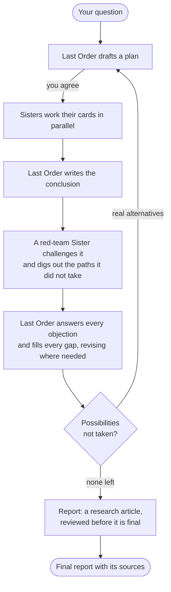

<h1 align="center">
  <br>
  MISAKA
</h1>

<p align="center"><strong>A research team of AI agents for the humanities and social sciences.</strong></p>

<p align="center"><em>Every conclusion faces a red team and keeps its sources beside it, says Misaka.</em></p>

<p align="center">
  <a href="LICENSE"></a>
  
  
</p>

<p align="center">English · <a href="README.zh-CN.md">简体中文</a> · <a href="README.ja.md">日本語</a></p>

You ask a question. **Last Order**, the coordinator, plans the research with you and hands the
parts to **Sisters**, specialist agents you create, who work in parallel in your terminal.
Before any conclusion stands, a red-team Sister challenges it and Last Order answers every
objection. The paths the conclusion did not take become research of their own. The report
lands in your project folder, next to every file it cites.

<p align="center">
  
</p>

## Quick start

```sh
uv tool install "misaka[providers] @ git+https://github.com/Luciole-Studio/Misaka-Agent.git"

mkdir my-research
cd my-research
misaka setup     # sign in, pick a model, create your first two Sisters
misaka           # open MISAKA and type /research
```

You need macOS, Linux or Windows with [uv](https://docs.astral.sh/uv/), git,
[ripgrep](https://github.com/BurntSushi/ripgrep), [fd](https://github.com/sharkdp/fd) and
poppler, and access to a model provider: an API key, or a ChatGPT or GitHub Copilot subscription.
A Claude account signs in too; Anthropic bills that use per token as extra usage. Install from
this repository: the `misaka` package on PyPI is an unrelated project.

[Getting started](docs/getting-started.md) walks you through each step and your first research
question.

## What it does

- **A team you design.** Each Sister has a specialty, which Last Order assigns work by, and her
  own skills, tools and model: one can run on Claude, another on GPT, another on a model on your
  own machine. Claude Code and Codex can join the team too.
- **Research that argues back.** Every conclusion is challenged by a red-team Sister, and Last
  Order answers each objection: she revises the conclusion, rebuts the objection, or accepts it
  as a cost, on the record.
- **The paths not taken, explored.** Other hypotheses, methods and readings that a
  conclusion passed over become branches of the research, each with its own team and red team,
  to the depth you choose.
- **Claims kept apart.** Facts, inferences, interpretations and value judgements are declared as
  such. When the evidence can't decide, rival conclusions stay side by side.
- **Traceable to the file.** Every node keeps its plan, each Sister's work, the conclusion and
  its critique, with a list of every file cited and a link to each one.
- **You stay in charge.** By default every plan waits for your go-ahead, given in plain
  conversation. Each branch has its own tab where you can talk to it. Runs can be stopped and
  resumed.
- **Your library and the web.** Index PDFs, EPUBs, DjVu, Word, Excel and PowerPoint files and
  notes. Agents read by chapter or page and find the page a quotation is on. Web search works
  without a key.
- **Long memory.** Long conversations are summarised as they grow, and an agent can still search
  what was said earlier, in her own conversation and in the others running in the project.

## How a research run works

> *The plan's ready! Misaka Misaka starts the moment you say so, says Misaka Misaka, holding it out with both hands.*



1. **Plan.** Last Order works out what the question really asks, gives each part to the Sister
   whose specialty fits, and names a red team. You talk the plan over; she starts when you agree.
2. **Cards.** Each assignment becomes a card. The Sisters work their cards in parallel and
   record each finding with its source. Last Order can send them out again before she
   concludes.
3. **Red team.** Last Order writes the conclusion. The red-team Sister challenges it, then reads
   it again for the possibilities it did not take and the gaps it left. Last Order answers every
   objection and fills every gap inside the node; a revised conclusion goes back for review.
4. **Branches.** Only real alternatives, resting on different premises, open as new research, one
   level at a time. Alternatives that ask the same question become one branch, no possibility is
   opened twice, and lines that arrive at the same place can be joined.
5. **Report.** When every branch has concluded, Last Order surveys them all and drafts the answer
   as a research article, with notes, a bibliography and appendices that record every line of
   inquiry, the costs the answer accepts and the paths not taken. An independent red team reviews
   the draft, and she rules on each objection in the final report.

The [research guide](docs/guide/research.md) covers depth, parallelism, following a run and
resuming it.

## What you get

> *Every source is filed where you can check it, Misaka reports.*

Everything is written into your project folder:

```text
my-research/
├── final/<run>-final.md     the report, with the costs it accepts and the paths not taken
├── final/<run>-sources/     every file the report cites, linked in place
└── nodes/<node>/            each piece of research
    ├── plan.md              what Last Order planned, and why these Sisters
    ├── cards/<card>/        each Sister's work, and the red team's critique
    ├── synthesis.md         the conclusion (synthesis-2.md once revised)
    └── SOURCES.md           every file the conclusion cites, and which claims rest on it
```

MISAKA commits only when you ask. If the project is a git repository, `/commit` commits it after
you have seen the files and agreed.

## Everyday commands

| To | Type |
|---|---|
| open MISAKA | `misaka` |
| start a research run | `/research`, then your question |
| check, stop or resume a run | `/research status`, `/research stop`, `/research resume` |
| talk to one Sister | `/sister 10032` |
| create a Sister | `misaka create 10036 --desc "Econometrics and causal inference"` |
| index your documents | `misaka doc scan sources/` |
| choose a model, sign in | `/model`, `/login` |
| see every command | `/` in chat, `misaka --help` in the terminal |
| see the panel's keys | `ctrl+b`, then `?` ([panel guide](docs/guide/panel.md)) |
| update | `misaka update --apply` |

The [command reference](docs/reference/commands.md) lists them all.

## Documentation

| To | Read |
|---|---|
| install and run your first question | [Getting started](docs/getting-started.md) |
| run and steer research | [Research runs](docs/guide/research.md) |
| build your team, add Claude Code or Codex | [The team](docs/guide/team.md) |
| find your way around the panel: tabs, panes, keys | [The panel](docs/guide/panel.md) |
| sign in, choose models, use a local model | [Models](docs/guide/models.md) |
| work with your documents and the web | [Documents and the web](docs/guide/sources.md) |
| fix a problem | [Troubleshooting](docs/guide/troubleshooting.md) |
| look up a command or a setting | [Commands](docs/reference/commands.md), [Configuration](docs/reference/configuration.md) |

[docs/README.md](docs/README.md) is the map of every page, with the words MISAKA uses.

## Your data and your bill

Everything MISAKA keeps stays on your machine: settings, credentials and history in
`~/.misaka/`, research output in your project folder. Your prompts go only to the model
providers you set up. Web searches go to the search services you set up, or to the free public
tiers of Exa, Parallel, Firecrawl and Keenable when there are none or one fails
(`misaka web set keyless_fallback false` turns that off). Literature scans send a question's
search terms to OpenAlex. MISAKA sends no telemetry.

A research run fans out: by default up to four branches at once, each with up to four Sisters
working as far as your machine's memory allows, so a deep run makes many model calls. Choose a
smaller depth for a cheaper run, and set `research.token_cap` in `~/.misaka/settings.json` for a
hard budget across all runs.

## About the name

MISAKA takes its names from Kazuma Kamachi's *A Certain Magical Index* and *A Certain
Scientific Railgun*, in which the Sisters, clones of the Railgun Misaka Mikoto, share their
memories through the Misaka Network.

| In the story | In MISAKA |
|---|---|
| **Misaka Mikoto**, the original every Sister comes from | `MISAKA.md`, the identity every agent loads before her own |
| **The Sisters**, known by serial number: Misaka 10032, 10033, … | your specialists, each with a number, a specialty and her own `SOUL.md` |
| **Last Order**, Misaka 20001, who commands the network | the coordinator you talk to |
| **The Misaka Network**, where what one Sister learns, the others can recall | the project's conversations, which every agent in it can search |

The "says Misaka" lines in this README are flavour; your agents talk however their `SOUL.md`
tells them to. One line in `SOUL.md` makes them talk like the Sisters.

MISAKA is an independent project. It is not affiliated with or endorsed by the author or the
publishers of the series.

## Built on

MISAKA's agent kernel is a Python port of [pi](https://github.com/earendil-works/pi), and its
panel is a port of [herdr](https://github.com/herdrdev/herdr), with
[ghostty](https://github.com/ghostty-org/ghostty)'s terminal library behind every pane. It
builds on [hermes-lcm](https://github.com/stephenschoettler/hermes-lcm) for long conversations
and [PageIndex](https://github.com/VectifyAI/PageIndex) for document structure, and ports web
tools and skills from [Hermes Agent](https://github.com/NousResearch/hermes-agent) and Office
support from [FrontierAgent](https://github.com/ApodexAI/FrontierAgent).
[THIRD_PARTY_NOTICES.md](THIRD_PARTY_NOTICES.md) records what came from where.

## Licence

[Apache License 2.0](LICENSE). Third-party components keep their own licences, recorded in
[THIRD_PARTY_NOTICES.md](THIRD_PARTY_NOTICES.md).

If you redistribute MISAKA or build on it, keep the attribution in [NOTICE](NOTICE): Apache-2.0
requires it to travel with your distribution.

<p align="center"><em>Misaka Network, signing off, says Misaka Misaka.</em></p>
