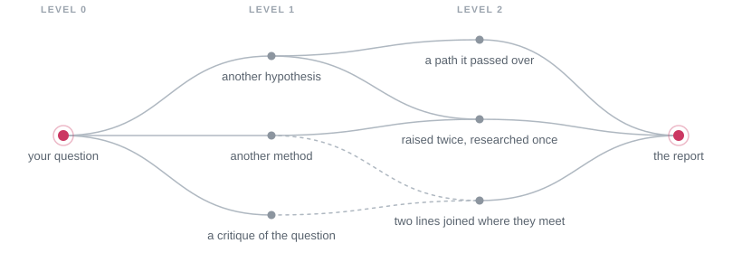

<h1 align="center">
  <br>
  MISAKA
</h1>

<p align="center"><strong>Pairing a DAG with symptomatic reading to unearth plural narratives: an AI agent architecture built for the humanities and social sciences.</strong></p>

<p align="center"><em>More important than presence is absence! says Misaka Misaka, rapping you on the head.</em></p>

<p align="center">
  <a href="LICENSE"></a>
  
  
</p>

<p align="center">English · <a href="README.zh-CN.md">简体中文</a> · <a href="README.ja.md">日本語</a></p>

Break the question down with **Last Order**, the coordinator, and refine the research plan; send
each branch of the inquiry to **Sisters**, specialists who report, liaise and consult; gather
their reports, read them and write; defend the conclusion before the reviewers; and turn whatever
it cannot cover into new research. Graph algorithms manage the graph of research branches, and
the final report arrives in your project folder as a research article, every citation traceable.

<p align="center">
  
</p>

## Core design

<table>
<tr><td><b>A division of means and ends</b></td><td>Each Sister brings her own specialty, skills and model (Claude, GPT, Gemini or a local model) to searching and reading within her field, and Claude Code and Codex can join as members to take on tasks. Because the specialists carry most of the searching and tool work, Last Order's context is reserved for studying the material they submit.</td></tr>
<tr><td><b>Symptomatic reading</b></td><td>Beyond examining facts and reasoning, the red team reads Last Order's reasoning for what the conclusion leaves unsaid yet relies on. The divergence review that follows sorts these absences in two. Oversights the line itself can repair are made good within the node; directions its premises occlude pass to Last Order, who either opens them as new research or records why she does not. These are the two forms of invisibility Althusser distinguished in symptomatic reading: what is overlooked, and what the problematic does not permit to be seen.</td></tr>
<tr><td><b>A directed acyclic graph of possibilities</b></td><td>Each new direction forks from Last Order's session, inheriting all prior reasoning, and becomes a node with its own team and red team. The graph unfolds level by level: each possibility is opened once, and a question raised by several lines is researched once. Lines that converge are confronted where they meet, integrated where they can be, and where they cannot, their disagreement is stated precisely.</td></tr>
<tr><td><b>Dissolving the question</b></td><td>Research may show that a question rests on a conceptual confusion or an ideological presupposition and cannot stand as posed. That is a legitimate conclusion in its own right. Before it alters the question you asked, Last Order seeks your consent.</td></tr>
<tr><td><b>Beyond doxa</b></td><td>A single exchange tends to stop at a model's most frequent answer: a doxa, widely held and seldom examined. Every plan carries a coverage table whose empty cells are declared gaps. The coverage maps derive from the schemes disciplines use to classify their own literature, whose blank spaces mark what a field has not counted as a question, and literature scans locate the question within the scholarship.</td></tr>
<tr><td><b>Traceability</b></td><td>Citations trace to the page. PageIndex builds chapter outlines of long documents, so agents read by chapter, cite printed pages and locate any quotation; OCR covers scans in Chinese, English and Japanese, and DjVu is supported. Context traces to the source. When a conversation exceeds the model's window, lossless context management (LCM) compresses it into summaries that each lead back to the original text, and every agent in a project searches the same memory.</td></tr>
<tr><td><b>An auditable research process</b></td><td>Plans, task cards, every version of a conclusion, critiques and source lists are kept as Markdown files in the project, which is itself a git repository. MISAKA commits only at your request and after you have reviewed the files, so the way an argument evolved under criticism is preserved in its history.</td></tr>
<tr><td><b>Under your direction</b></td><td>No plan proceeds without your approval, which you give in ordinary conversation. Each branch has its own tab in the panel, and every agent runs in a pane you can enter at any time. Runs can be halted and resumed.</td></tr>
</table>

## Quick start

```sh
uv tool install "misaka[providers] @ git+https://github.com/Luciole-Studio/Misaka-Agent.git"

mkdir my-research
cd my-research
misaka setup     # sign in, choose a model, create your first two Sisters
misaka           # start MISAKA and type /research
```

MISAKA runs on macOS, Linux and Windows (x86_64 or arm64). It requires
[uv](https://docs.astral.sh/uv/), git, [ripgrep](https://github.com/BurntSushi/ripgrep),
[fd](https://github.com/sharkdp/fd) and poppler, and access to a model provider: an API key, or a
ChatGPT or GitHub Copilot subscription. Claude accounts can also sign in, with that usage billed
by Anthropic per token as extra usage. Install from this repository: the `misaka` package on PyPI
is an unrelated project.

[Getting started](docs/getting-started.md) covers installation step by step and walks you through
a first research question.

## How research proceeds

> *The plan's ready! Misaka Misaka starts the moment you say so, says Misaka Misaka, holding it out with both hands.*

A run is a graph of possibilities: your question is the root, and each possibility a conclusion
sets aside becomes a node beneath it, level by level.

<p align="center">
  
</p>

1. **Each node is a complete piece of research.** Last Order agrees the plan with you and proceeds
   only with your approval. Until the specialists submit their materials, she decomposes the
   question into sub-questions and prior questions and presumes no conclusion. The Sisters work
   their cards in parallel, recording the source of every finding, and Last Order writes the
   conclusion once she has studied them.
2. **Red team and divergence review.** A red-team Sister examines the facts and reasoning and
   identifies what the conclusion leaves unsaid. A divergence review, conducted in a fresh
   session, then separates the possibilities the conclusion set aside from the gaps it left. Last
   Order answers each objection and fills each gap within the node, and the revised conclusion
   returns for review.
3. **The graph unfolds.** Only genuine alternatives, resting on different premises, fork from Last
   Order's session as new nodes, inheriting all prior reasoning. Each has its own Last Order,
   Sisters and red team, and the graph extends level by level to the depth you set. A question
   raised by several lines is researched once, each possibility is opened once, and converging
   lines are confronted where they meet.
4. **The report.** Once every node has closed, Last Order surveys them all and composes the
   arguments the research reached into a research article, with notes, a bibliography and
   appendices recording every line of inquiry, the costs the answer accepts and the paths not
   taken. An independent red team reviews the draft, and Last Order rules on each objection in the
   final version.

The [research guide](docs/guide/research.md) covers depth, concurrency, monitoring a run and
resuming it.

## Outputs

> *Every source is filed where you can check it, Misaka reports.*

All output is written to your project folder:

```text
my-research/
├── final/<run>-final.md     the final report, with the costs it accepts and the paths not taken
├── final/<run>-sources/     every file the report cites, linked in place
└── nodes/<node>/            one directory per piece of research
    ├── plan.md              Last Order's plan and her reasons for choosing each Sister
    ├── cards/<card>/        each Sister's work and the red team's critique
    ├── synthesis.md         the conclusion (synthesis-2.md and onward once revised)
    └── SOURCES.md           every file the conclusion cites, and the claims each one supports
```

MISAKA commits only at your request. If the project is a git repository, `/commit` lists the files
for your confirmation before committing.

## Common commands

| Purpose | Command |
|---|---|
| Start MISAKA | `misaka` |
| Begin a research run | `/research`, followed by your question |
| Check, halt or resume a run | `/research status`, `/research stop`, `/research resume` |
| Talk to a single Sister | `/sister 10032` |
| Create a Sister | `misaka create 10036 --desc "Econometrics and causal inference"` |
| Index your documents | `misaka doc scan sources/` |
| Choose a model, sign in | `/model`, `/login` |
| List every command | `/` in chat, `misaka --help` in the terminal |
| Show the panel's key bindings | `ctrl+b`, then `?` (see the [panel guide](docs/guide/panel.md)) |
| Update | `misaka update --apply` |

The [command reference](docs/reference/commands.md) lists every command.

## Documentation

| Topic | Guide |
|---|---|
| Installing and running a first question | [Getting started](docs/getting-started.md) |
| Running and steering research | [Research runs](docs/guide/research.md) |
| Building a team, adding Claude Code or Codex | [The team](docs/guide/team.md) |
| The panel: tabs, panes and key bindings | [The panel](docs/guide/panel.md) |
| Signing in, choosing models, local models | [Models](docs/guide/models.md) |
| Working with documents and the web | [Documents and the web](docs/guide/sources.md) |
| Troubleshooting | [Troubleshooting](docs/guide/troubleshooting.md) |
| Command and configuration reference | [Commands](docs/reference/commands.md), [Configuration](docs/reference/configuration.md) |

[docs/README.md](docs/README.md) indexes every page and defines the terms MISAKA uses.

## Data and cost

All data MISAKA keeps stays on your machine: settings, credentials and history in `~/.misaka/`,
research output in your project folder. Prompts are sent only to the model providers you
configure. Web searches go to the search services you configure, or, when none is configured or
one fails, to the free public tiers of Exa, Parallel, Firecrawl and Keenable
(`misaka web set keyless_fallback false` disables this). Literature scans send a question's search
terms to OpenAlex. MISAKA sends no telemetry.

A research run operates at scale: by default up to four branches run at once, each with up to four
Sisters working in parallel as memory allows, so a deep run makes many model calls. A smaller
depth reduces cost, and `research.token_cap` in `~/.misaka/settings.json` sets a hard budget
across all runs.

## About the name

MISAKA takes its names from Kazuma Kamachi's *A Certain Magical Index* and *A Certain
Scientific Railgun*, in which the Sisters, clones of the Railgun Misaka Mikoto, share their
memories through the Misaka Network.

| In the story | In MISAKA |
|---|---|
| **Misaka Mikoto**, the original every Sister comes from | `MISAKA.md`, the shared identity every agent loads before her own |
| **The Sisters**, known by serial number: Misaka 10032, 10033, … | your specialists, each with a number, a specialty and her own `SOUL.md` |
| **Last Order**, Misaka 20001, who commands the network | the coordinator you talk to |
| **The Misaka Network**, through which what one Sister learns the others can recall | the project's conversations, searchable by every agent in it |

The "says Misaka" lines in this README are ornamental; each agent speaks as her `SOUL.md`
specifies, and a single line there gives her the Sisters' manner of speech.

MISAKA is an independent project. It is not affiliated with or endorsed by the author or the
publishers of the series.

## Foundations

MISAKA's agent kernel is a Python port of [pi](https://github.com/earendil-works/pi), and its
panel is a port of [herdr](https://github.com/herdrdev/herdr), with
[ghostty](https://github.com/ghostty-org/ghostty)'s terminal library behind every pane. It builds
on [hermes-lcm](https://github.com/stephenschoettler/hermes-lcm) for long conversations and
[PageIndex](https://github.com/VectifyAI/PageIndex) for document structure, and ports web tools
and skills from [Hermes Agent](https://github.com/NousResearch/hermes-agent) and Office support
from [FrontierAgent](https://github.com/ApodexAI/FrontierAgent).
[THIRD_PARTY_NOTICES.md](THIRD_PARTY_NOTICES.md) records the origin of each part.

MISAKA builds on pi for its simple kernel and its mature, actively maintained community, which lets
MISAKA follow upstream directly. MISAKA's graph governs the content and possibilities of research:
a node is a completed piece of research, and an edge is a line of inquiry that forked off carrying
its reasoning.

## Licence

MISAKA is released under the [Apache License 2.0](LICENSE). Third-party components keep their own
licences, recorded in [THIRD_PARTY_NOTICES.md](THIRD_PARTY_NOTICES.md).

If you redistribute MISAKA or build on it, keep the attribution in [NOTICE](NOTICE): Apache-2.0
requires it to accompany your distribution.

<p align="center"><em>Misaka Network, signing off, says Misaka Misaka.</em></p>
