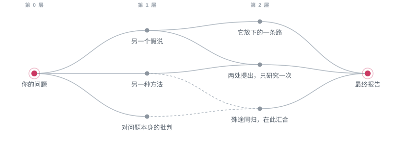

<h1 align="center">
  <br>
  MISAKA
</h1>

<p align="center"><strong>将 DAG 与症候阅读结合、挖掘多元叙事，专为人文社科研究打造的 AI Agent 架构。</strong></p>

<p align="center"><em>比在场更重要的是缺席！御坂御坂敲了敲你的脑袋。</em></p>

<p align="center">
  <a href="LICENSE"></a>
  
  
</p>

<p align="center"><a href="README.md">English</a> · 简体中文 · <a href="README.ja.md">日本語</a></p>

与协调者 **Last Order**（最后之作）一起拆解问题，完善研究计划，把研究的各个分支领域调查任务派发给善于报告-联络-讨论的 **Sisters**（妹妹们），将各位专家的调研报告汇总归纳，阅读和撰写，与评审员完成答辩，将结论无法涵盖的方向转化为新的研究。用图论算法来管理研究分支图，最终报告以研究论文的形式写进你的项目文件夹，每一处引用都可溯源。

<p align="center">
  
</p>

## 核心设计

<table>
<tr><td><b>像调用技能一样调用专家</b></td><td>Last Order 调用一位 Sister，如同调用一项技能。技能沿用 Hermes 的分层加载：系统提示只列出每项技能的名称与简介，完整的 SKILL.md 与参考文件在需要时才读取。Sister 按同样的层次暴露：DESCRIBE.md 相当于技能简介，Last Order 平时只看到其简介与开头一段，规划研究时再读取完整介绍与她的技能清单；SOUL.md 与各项技能的正文只在 Sister 自己的会话中载入，不占用 Last Order 的上下文。</td></tr>
<tr><td><b>手段与目的的分工</b></td><td>每位 Sister 配备独立的专长、技能与模型（Claude、GPT、Gemini 或本地模型），负责各自领域的检索与研读；Claude Code 与 Codex 亦可作为成员承接任务。检索与工具操作主要由专家承担，Last Order 的上下文因而专用于研读专家提交的材料。不需思考手段，便可专精目的。</td></tr>
<tr><td><b>症候阅读</b></td><td>红队在核查事实与推理之外，同时研读 Last Order 的推理过程，指认结论未曾言明、却支撑其论证之处。其后的歧路审将此类缺席区分为两类：研究线自身可以弥补的疏漏，在本节点内补足；为其前提所遮蔽的方向，交由 Last Order 决定是否另立研究，不予开立者须载明理由。此即阿尔都塞在症候阅读中区分的两种“不可见”：视而未见者，与问题式所不容看见者。</td></tr>
<tr><td><b>可能性的有向无环图</b></td><td>每一新方向均自 Last Order 的会话分叉，承继此前的全部推理，成为配备独立团队与红队的节点。研究图逐层展开：同一可能只开立一次，多条研究线共同提出的问题只研究一次；殊途同归的研究线在汇合处相互对质，可统合者统合，不可调和者划清分歧。</td></tr>
<tr><td><b>问题的消解</b></td><td>研究可以论证某一问题建立于概念混淆或意识形态预设之上、无法按原样成立，此即正当的研究结论。若由此须改动你所提出的问题，Last Order 将事先征得你的同意。</td></tr>
<tr><td><b>越出 doxa</b></td><td>单次问答的回答，往往止于模型最高频的说法，即一种广为接受而未经检视的 doxa。每份研究计划须附覆盖表，空缺即事先声明的研究缺口；覆盖图取自各学科为自身文献编制的分类体系，其空白处标示出一个领域未曾视为问题的方向，文献扫描则标定问题在学术史中的位置。</td></tr>
<tr><td><b>可溯源</b></td><td>引文可溯至页码：PageIndex 为长文档生成章节目录，agent 按章研读、按印刷页码引用，并可定位任一引文所在页；扫描件支持中、英、日文 OCR 与 DjVu。上下文可溯至原文：对话超出模型容量时，无损上下文管理（LCM）将其压缩为摘要，每条摘要均可回溯至原始文本，项目内所有 agent 共享同一检索记忆。</td></tr>
<tr><td><b>研究过程可审计</b></td><td>计划、任务卡、结论的各个版本、批评意见与出处清单，均以 Markdown 文件保存在项目中，项目本身为 git 仓库。MISAKA 仅在你要求并确认文件后提交，论证在批评中的演变完整保留于版本历史。</td></tr>
<tr><td><b>由你主导</b></td><td>每份计划均须经你同意方可执行，确认通过自然对话完成。每个分支在面板中拥有独立标签页，每个 agent 运行于可随时进入的窗格；研究可中止，亦可恢复。</td></tr>
</table>

## 快速开始

```sh
uv tool install "misaka[providers] @ git+https://github.com/Luciole-Studio/Misaka-Agent.git"

mkdir my-research
cd my-research
misaka setup     # 登录、选择模型、创建最初的两位 Sister
misaka           # 启动 MISAKA，输入 /research
```

运行环境为 macOS、Linux 或 Windows（x86_64 或 arm64）。需预先安装 [uv](https://docs.astral.sh/uv/)、git、[ripgrep](https://github.com/BurntSushi/ripgrep)、[fd](https://github.com/sharkdp/fd) 与 poppler，并准备一个模型服务商：API 密钥，或 ChatGPT、GitHub Copilot 订阅。亦支持以 Claude 账号登录，相应用量由 Anthropic 按 token 另行计为额外用量。请从本仓库安装：PyPI 上的 `misaka` 为另一无关项目。

[入门指南](docs/getting-started.zh-CN.md)逐步介绍安装流程，并引导你完成第一个研究问题。

## 研究流程

> *计划写好啦！只要你点头，御坂御坂马上开工！御坂御坂双手捧着计划书说道。*

一次研究即一张由可能性构成的图：你的问题是根节点，结论所放弃的每一种可能，逐层成为其下的节点。

<p align="center">
  
</p>

1. **每个节点都是一项完整的研究。** Last Order 与你商定计划，经你同意后开始执行。专家材料提交之前，Last Order 只拆解子问题与前提问题，不预设结论；Sisters 并行完成任务卡，每项发现均注明出处，Last Order 研读后撰写结论。
2. **红队与歧路审。** 红队 Sister 核查事实与推理，并指认结论未曾言明之处；随后在新会话中进行歧路审，区分结论所放弃的可能与遗留的缺口。Last Order 在本节点内逐条回应并补足缺口，修订后的结论再次送审。
3. **研究图逐层展开。** 仅前提不同的真正替代可能，才会自 Last Order 的会话分叉为新节点，承继此前的全部推理，并各自配备 Last Order、Sisters 与红队，逐层展开至设定深度。多条研究线共同提出的问题只研究一次，同一可能只开立一次，殊途同归的研究线在汇合处相互对质。
4. **报告。** 全部节点结束后，Last Order 通览各节点，将研究所得论点编排为一篇研究论文，附注释与参考文献，并以附录记录每条研究线、答案承担的代价与未采纳的路径。初稿经独立红队审查后，由 Last Order 对每条异议作出裁决，形成终稿。

研究深度、并发、进度跟踪与恢复，详见[研究指南](docs/guide/research.md)（英文）。

## 研究产出

> *引用的每一份材料都已归档，随时可以核查，御坂如此报告。*

全部产出均写入你的项目文件夹：

```text
my-research/
├── final/<run>-final.md     最终报告，含所承担的代价与未采纳的路径
├── final/<run>-sources/     报告引用的全部文件（链接至原位置）
└── nodes/<node>/            各项研究
    ├── plan.md              Last Order 的研究计划及 Sister 的选派理由
    ├── cards/<card>/        各 Sister 的工作成果与红队批评
    ├── synthesis.md         结论（修订版依次为 synthesis-2.md 等）
    └── SOURCES.md           结论引用的文件及其所支撑的论断
```

MISAKA 仅在你要求时提交。若项目为 git 仓库，可使用 `/commit` 提交，提交前将列出文件供你确认。

## 常用命令

| 用途 | 命令 |
|---|---|
| 启动 MISAKA | `misaka` |
| 开始研究 | `/research`，随后输入问题 |
| 查看、中止或恢复研究 | `/research status`、`/research stop`、`/research resume` |
| 与单个 Sister 对话 | `/sister 10032` |
| 创建 Sister | `misaka create 10036 --desc "实证计量与因果识别"` |
| 为文档建立索引 | `misaka doc scan sources/` |
| 选择模型、登录 | `/model`、`/login` |
| 查看全部命令 | 对话中输入 `/`，终端中运行 `misaka --help` |
| 查看面板快捷键 | 先按 `ctrl+b`，再按 `?`（见[面板指南](docs/guide/panel.md)） |
| 更新 | `misaka update --apply` |

完整命令列表见[命令参考](docs/reference/commands.md)（英文）。

## 文档

| 主题 | 文档 |
|---|---|
| 安装并运行第一个研究问题 | [入门指南](docs/getting-started.zh-CN.md) |
| 运行与引导研究 | [研究指南](docs/guide/research.md) |
| 组建团队，接入 Claude Code 或 Codex | [团队指南](docs/guide/team.md) |
| 面板：标签页、窗格与快捷键 | [面板指南](docs/guide/panel.md) |
| 登录、选择模型、接入本地模型 | [模型指南](docs/guide/models.md) |
| 文档与网络资源的使用 | [文档与网络](docs/guide/sources.md) |
| 故障排查 | [排障](docs/guide/troubleshooting.md) |
| 命令与配置参考 | [命令](docs/reference/commands.md)、[配置](docs/reference/configuration.md) |

[docs/README.md](docs/README.md) 提供全部文档的索引及术语说明。除入门指南外，上述文档目前仅提供英文版。

## 数据与费用

MISAKA 的全部数据均保存在本地：设置、凭据与历史位于 `~/.misaka/`，研究产出位于项目文件夹。提示词仅发送至你配置的模型服务商。网页搜索发送至你配置的搜索服务；未配置或服务出错时，改用 Exa、Parallel、Firecrawl 与 Keenable 的免费公共接口（可通过 `misaka web set keyless_fallback false` 关闭）。文献扫描会将检索词发送至 OpenAlex。MISAKA 不发送任何遥测数据。

一次研究的调用规模可能相当可观：默认最多同时运行四个分支，每个分支最多四位 Sister 并行工作（以机器内存为限），深度研究因此会产生大量模型调用。如需控制成本，可选择较小的研究深度；如需为所有研究设定硬性上限，可在 `~/.misaka/settings.json` 中设置 `research.token_cap`。

## 名字的由来

MISAKA 之名取自镰池和马的《魔法禁书目录》与《某科学的超电磁炮》。在原作中，妹妹们（Sisters）是「超电磁炮」御坂美琴的克隆体，经由御坂网络共享记忆。

| 原作 | MISAKA |
|---|---|
| **御坂美琴**，所有妹妹的本体 | `MISAKA.md`：每个 agent 在读取自身设定之前，先读取这份共同身份 |
| **妹妹们**，以编号相称：御坂 10032 号、10033 号…… | 你的专家，各有编号、专长与独立的 `SOUL.md` |
| **最后之作**（Last Order），御坂 20001 号，御坂网络的司令塔 | 与你对话的协调者 |
| **御坂网络**，一位妹妹之所学，其他妹妹亦能忆起 | 项目内的对话记录，所有 agent 均可检索 |

文中「御坂如此说道」之类的语句仅作点缀；各 agent 的说话方式由其 `SOUL.md` 决定，如需相同口吻，在 `SOUL.md` 中加入一句即可。

MISAKA 为独立项目，与原作作者及出版方无任何关联，亦未获其认可。

## 技术基础

MISAKA 的 agent 内核为 [pi](https://github.com/earendil-works/pi) 的 Python 移植，面板移植自 [herdr](https://github.com/herdrdev/herdr)，各窗格的终端仿真基于 [ghostty](https://github.com/ghostty-org/ghostty) 的终端库。长对话管理基于 [hermes-lcm](https://github.com/stephenschoettler/hermes-lcm)，文档结构解析基于 [PageIndex](https://github.com/VectifyAI/PageIndex)；网页工具与技能移植自 [Hermes Agent](https://github.com/NousResearch/hermes-agent)，Office 支持移植自 [FrontierAgent](https://github.com/ApodexAI/FrontierAgent)。各部分来源详见 [THIRD_PARTY_NOTICES.md](THIRD_PARTY_NOTICES.md)。

MISAKA 以 pi 为底座，因其内核简洁，且有成熟社区维护，可直接跟进上游更新。MISAKA 的图所治理的是研究的内容与可能性：节点为一项完成的研究，边为一次承载推理的分叉追问。

## 许可证

本项目以 [Apache License 2.0](LICENSE) 发布。第三方组件保留各自的许可证，详见 [THIRD_PARTY_NOTICES.md](THIRD_PARTY_NOTICES.md)。

再发布或基于 MISAKA 进行改编时，请保留 [NOTICE](NOTICE) 中的署名：Apache-2.0 要求该署名随发行物一并提供。

<p align="center"><em>以上，御坂网络通信结束，御坂御坂如此说道。</em></p>
