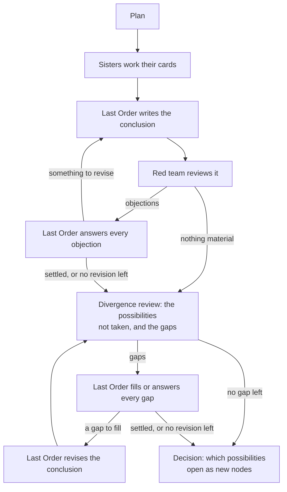

# Research runs

A research run answers one question by exploring the different ways it could be answered. Your
question is the first **node**. Last Order plans it with you, the Sisters research it, and she
writes a conclusion. A red-team Sister then challenges that conclusion and brings out the
possibilities it passed over. Errors and gaps are fixed inside the node; a real alternative,
resting on different premises, opens as a new node with its own Last Order, Sisters and red team.
The run grows this way, one level at a time, into a **research graph**, and ends with a report
written as a research article.

This page covers starting a run, what happens inside each node, how the graph grows, following
and steering a run, and what it leaves in your project. For a first run, see
[Getting started](../getting-started.md#5-ask-your-first-question).

## Starting a run

A run needs a project folder and at least one Sister (`misaka create 10032`). Two are better:
one can review the other's work.

### From chat

In Last Order's window, type `/research`. A picker asks nine questions, then takes your next
message as the question. Enter accepts the suggestion, "Other" takes a value of your own (such
as `0.6` or `60%` for compaction, `48k` for the output limit), and "Chat about this" lets you
talk the options over with Last Order first.

| Question | Choices | What it changes |
|---|---|---|
| Research depth | 2, 5, 10 | how many levels of alternatives may open below your question. 2 is a quick pass, 10 is exhaustive and costly. |
| LO parallelism | 4, 1, 8 | how many nodes run at the same time |
| Sister cards per LO | 4, 1, 8 | how many Sister cards one node runs at the same time |
| Follow-ups | 2, 0, 4 | how many extra rounds of cards a node may send out after the first |
| Revisions | 2, 0, 4 | how many times a node may rework its conclusion in each review loop: after the red team, and again after the divergence review |
| Nodes | 30, 12, 80 | how many nodes the whole run may hold, your question included |
| Plan approval | Require approval, Automatic | whether plans wait for you ([below](#approving-plans)) |
| Compaction | your setting, 0.5, 0.85 | how full a conversation gets before older turns are summarised |
| Output limit | model maximum, 64k, 32k | the longest reply a model may write |

The last two apply to this run only.

To skip the picker, put the question and any options on one line:

```text
/research --depth 2 --max-nodes 12 How did the 1918 influenza change public health law in Japan?
```

Options you leave out take the defaults: depth 3, 4 nodes and 4 cards at once, 2 follow-ups,
2 revisions, 30 nodes. `/research 3` on its own sets the depth and waits for the question.

### From the shell

```sh
misaka research --depth 3 --max-nodes 30 "QUESTION"
```

It takes the same options. Depth runs from 0 (your question only) to 12, follow-ups and
revisions from 0 to 6, nodes from 1 to 500. The other nodes run in the background; see
[Runs started from the shell](#runs-started-from-the-shell) to talk to them.

## Approving plans

Every plan in a run can wait for your go-ahead: the first plan, each new node's plan, each extra
round, and each rearrangement of the graph between levels.

- **Require approval** (the default). Last Order shows you the plan and you talk it over in plain
  words: ask what a part is for, ask for changes, or say it looks good. She starts when you agree.
- **Automatic.** Plans go ahead as soon as they are written. Last Order still asks when she needs
  your input, and a plan that changes the question itself always waits for you.

The choice is saved with the run, for all its nodes and any resume. To make Automatic your
default, set `research.plan_approval` to `false` in `settings.json`.

Where a plan waits for you:

| Plan | Where you talk it over |
|---|---|
| the first plan, and the rearrangements between levels | the window you started the run in |
| any other node's plan | that node's own tab in the panel |
| any plan of a run started from the shell | the session the command prints: `misaka chat --attach --session PATH` |

Besides changing a plan, you can:

- **skip a node** you decide to leave aside. It closes at once, and the final report lists it
  among the paths not taken, with your reason;
- **drop an extra round**, so the node concludes from what it already has;
- **stop the whole run** with `/research stop`.

If a run that nobody is watching needs an answer before it can plan, it pauses with its
questions. Answer with `/research resume RUN_ID YOUR ANSWER`.

## Inside a node

Every node, your question included, goes through the same steps:



The red team's loop comes first; only when it is over does the divergence review begin, and its
own loop runs until no gap is left. A node at the depth limit ends after the red team's loop: with
nothing to fork, it has no divergence review.

### 1. The plan

The plan is a research design. Last Order works out what the question really asks, what else it
could mean, and which of its assumptions are untested. She sets out the evidence needed, the
methods and sources to use and what each of them misses, and why each Sister fits her part.

- **One card per assignment.** When the question turns on several actors, regions, institutions
  or periods, each gets a card of its own.
- **A coverage table** sets every sub-question, actor and dimension against the cards that serve
  it, so a gap shows up as an empty cell.
- **The red team is named here**, for two jobs: reviewing every version of the conclusion, and
  the divergence review.

A first plan may also record **decisions**: points where the question can be answered in
genuinely different ways, such as competing hypotheses, methods, frameworks or readings, or a
critique of the question itself. A decision has at least two options that exclude each other,
each with its premise, and the node's own line can be one of them. Work that adds to the same
answer becomes more cards.

When the options open depends on the plan:

- **Beside the node's own cards**, they open after the node has concluded, and each one answers
  that conclusion.
- **In a plan with no cards of its own** (a pure branch point), they open straight away, side by
  side and independent of each other. This suits readings or methods whose agreement should
  count as independent confirmation; the main line goes in as one of the options.

A node that tries another framework says which material that framework points to that its
parents did not read, and what in it would count against their conclusions.

### 2. The cards

Each assignment becomes a **card**: a Markdown file with the task, its sources and what to
deliver. The Sisters (and [allies](team.md#allies) such as Claude Code) work their cards in
parallel, each in its own session, in panes beside Last Order.

As she works, a Sister declares each finding: the claim, what kind of claim it is (fact,
inference, interpretation or value judgement), the file or document and page it rests on, and the
quotation if there is one. The red team and Last Order weigh these later.

When the cards are back, Last Order either concludes or sends the Sisters out for another round,
up to the follow-up limit. On the last round she concludes and names what remains unsupported.

### 3. The conclusion

Last Order reads what the cards delivered, in full, and writes the conclusion (`synthesis.md`):
shared and competing findings, key evidence and counterevidence, the limits of the methods, and
what stays open. It also says:

- which presuppositions the conclusion rests on, and what each one gains, gives up and trades;
- what it does not know: what its sources could not reach, whose voices are missing, what its
  frame keeps out of view;
- how it answers the node it came from and the strongest case of its rival options.

A conclusion may be a position that openly accepts named **costs**, or a **dissolution**: a
showing that the question rests on a confusion or an ideological presupposition. A dissolution
is a legitimate result.

If the cards show that an earlier node got something wrong (a fact, a date, an attribution, a
reference that does not exist), Last Order records an **erratum** against it. The correction is
shown beside the earlier conclusion, in every node below it and in the final report.

### 4. The red team

The red-team Sister reads the conclusion, the plans, the evidence, the graph so far and Last
Order's own reasoning on the node, and writes a critique (`critique.md`). She:

- checks the facts the conclusion rests on against sources of her own, starting with claims from
  cards that consulted no source;
- raises the **gaps**: anything an answer to this question has to cover and this one leaves out;
- checks that the conclusion answers the node it came from and its rivals. For a node opened to
  question its parent's framing, she asks what the question becomes under that critique;
- reads what the conclusion and the reasoning leave unsaid, where the silence carries the
  argument.

She records each objection separately and marks the serious ones; only what she records is acted
on, so before she submits the review she is shown her record and checks her file against it. A
question another node already owns, she names by that node.

### 5. Answering the review

Last Order answers every serious objection of the red team, one answer each:

| Answer | Meaning |
|---|---|
| **revise** | it is right: she reworks the conclusion. A gap is filled with research, a new card while follow-up rounds remain. |
| **rebut** | it does not hold, and she gives her reason, which the red team sees. |
| **concede** | the conclusion stands and accepts this cost. The final report lists it with the costs the answer accepts. |
| **covered** | another node owns this question, and she says how its work answers it. |
| **park** | it stays open, and the final report says so. |
| **branch** | it reveals a real alternative (the framework breaks down, or a critique aims at the question itself). It goes to the decision. |

A node settles its own objections and gaps: what it cannot fill, it concedes or parks on the
record. Before she answers an objection about material a card delivered, Last Order can put it to
that card's Sister: a finished card is woken in her own session, and Last Order waits for her
answer before deciding.

While something is revised and revisions remain, Last Order writes the next version
(`synthesis-2.md`, …) and the same red-team Sister reviews it in her own conversation, with Last
Order's answers in front of her (`critique-2.md`, …). She checks whether each revision fixed what
it set out to fix, whether each rebuttal holds, and what the revision changed. The loop ends when
nothing more is revised or the revisions run out. After that, plain errors the last review names,
such as a wrong date or figure, are **corrected** in a `## Corrections` section at the end of the
conclusion.

### 6. The divergence review

When the red team's loop is over, the same Sister opens a fresh session and reads the conclusion
again for the choices it made. She brings out two kinds of thing (`divergence.md`):

- **possibilities not taken**: other hypotheses, methods, frameworks, readings, sources and
  voices, other ways of dividing the question, or a critique of the question itself. They include
  what the conclusion gave up and what it never considered, and each rests on a premise different
  from the conclusion's;
- **gaps**: what the conclusion neglected and any answer needs.

For each choice she digs out the presuppositions behind it and what it gained and gave up, and
leaves it to research whether they hold. She starts from the run's **paths list** (below) and
skips what is already on it. Like the red team, she records each proposal, and only the record is
acted on: before she submits, she is shown it and checks her file against it.

The gaps are the node's own. Last Order fills or answers each one; every version she revises to
fill a gap, the same Sister reviews again in her own conversation (`divergence-2.md`, …), until a
review finds no gap left or the gap revisions run out (the same limit as the red team's). A gap
gets the answers above except *branch*: a gap is never a fork. Only then do the possibilities not
taken go to the node's decision.

### 7. The decision

Last Order goes through the possibilities not taken, and any objection she answered with
*branch*, and records each as:

- an **option** of a decision, with its premise, to open as a new node;
- **covered**, when a node or a waiting option already pursues it;
- **declined**, with her reason. The final report lists declined paths and why.

A fork is a possibility that excludes the node's own line. A presupposition the answer depends
on becomes one too: the node opened for it researches whether it holds, and what the answer
becomes if it does not.

## How the graph grows

The run goes one level at a time: all nodes at one depth finish before the next depth starts.

### Between levels

When a level has finished, Last Order looks across the whole graph, in the window you started
the run in, and rearranges it. With approval on, she presents this to you like a plan.

- **Waiting options open as new nodes**, except those that complement an existing node, that a
  node already pursues, that are really corrections, or that the depth or node limit stops. A
  limit you put in your question counts too ("open two at most"): she opens the options with
  the strongest reasons and records the rest as not opened because of it. What your question
  says about how the run is carried out (which or how many Sisters, how many forks, how fast)
  holds for every node's plan, not only the first.
- **Options that ask the same question become one node** with several parents, so it is
  researched once. Two readings that share a name but define their key concept differently count
  as different questions.
- **Finished nodes that arrive at the same place by different routes can be joined**: a new node
  carries them forward together and may branch again. In a join the lines confront each other:
  what can be combined is combined, and where they disagree the disagreement is drawn sharply.
  Conclusions that simply agree are recorded as converging, which is a finding in itself.
- **Relations between nodes are recorded**: where they converge or diverge, and where one echoes,
  borrows from or displaces another. The final report draws on them.

### The paths list

The run keeps a list of every possibility raised so far, grouped under the node that raised it,
with what became of it (`final/<run>-paths.md`). Each possibility is opened once: one that a node
already pursues goes to that node, and a declined path comes back only with an answer to why it
was declined.

A new node starts from a copy of the conversation of the node it came from, so it knows how its
question arose. A join starts from what its lines have in common, with a brief on each of them
(`context.md`).

`final/<run>-graph.md` draws the whole graph, and Last Order can show you where it stands
whenever you ask.

## The final report

When every node has closed, Last Order writes the report in four steps:

1. **a survey**, one section per node: its question and how it arose, its methods and
   conclusion, what each revision changed, the objections and what became of them, the
   corrections, the possibilities it raised, and what the nodes after it found;
2. **a draft** answer to your question;
3. **an independent review** of the draft by the red team, which also checks that it stays
   faithful to the research;
4. **the final report**, where Last Order accepts, rejects or leaves open each objection with her
   reasons, and revises the draft where the review holds.

The report is a research article for a reader in the humanities and social sciences, in the
language of your question: title, abstract and keywords, an introduction with the question, its
concepts and the research design, chapters that argue, and a conclusion. Every line of inquiry's
final conclusion has its place in the argument, as a finding, an objection, a qualification or a
rival reading. The body names lines of inquiry by what they argued and sources by author and
title; the apparatus carries the rest:

- **notes** citing author, title, year and page, with the file in the project where there is one;
- **a bibliography** of every work cited;
- **Appendix I, the lines of inquiry**: every node, its question, its conclusion in a sentence,
  and where the article takes it up;
- **Appendix II, the record**: the costs the answer accepts, the corrections, the paths not taken
  and why, what stays open, and where independent lines converge and diverge;
- **Appendix III, the materials**: where to find the full list of what the run read and
  downloaded;
- **Appendix IV, the review**: which objections changed the answer, which were rejected and why,
  and which remain unsettled.

The article is built from the research itself. Its theses, its arguments and the links between
lines come from the nodes' conclusions, what each did with its objections, and the decisions,
joins and relations that connect them, and Last Order argues every link she draws from those
materials. Where the findings of different lines bear on one another, she weaves them into one
argument; where their premises cannot be reconciled, the positions stay apart and the article
says where they part. The materials may hold positions far from received opinion: the article
keeps them as the research found them, and checks their facts against sources. Anything she
retrieves while writing that changes a conclusion is disclosed.

If a node concluded that your question itself dissolves, Last Order asks you before drafting.
With your agreement, the report answers with the dissolution; otherwise it answers the question
as asked and presents the dissolution as one reading.

## Following a run

### In the panel

Each node below the root opens in a **tab** of its own, with its Last Order in the main pane and
her Sisters beside her. Type in that tab to talk to that node's Last Order, to ask what she is
doing or to steer her. The tab stays open after the node finishes, so you can ask about what she
found. Closing a tab while its node is working ends the node as failed.

The sidebar's agents list shows who is working and who needs you; the [panel guide](panel.md)
explains the tabs, panes and keys.

### Commands

| To | In chat | From the shell |
|---|---|---|
| see how a run is doing | `/research status [RUN_ID]` | `misaka board` (its cards) |
| stop a run and get a partial report | `/research stop [RUN_ID]` | Ctrl+C in the running command |
| resume a stopped or failed run | `/research resume [RUN_ID] [ANSWER]` | `misaka research --resume RUN_ID` |
| resume in a different window | `/research resume RUN_ID --here` | |
| change a running run's limits | `/research limits [RUN_ID] --sister-parallel 2 …` | `misaka research --limits RUN_ID --sister-parallel 2 …` |

Resume a run in the Last Order conversation that started it; from any other window,
`/research resume` names the conversation to open (the sidebar lists it under sessions).
`--here` resumes in the current window, whose Last Order starts without the run's earlier
conversation.

A resumed run needs the Sisters its cards went to. If you removed one, create her again with the
same number first.

### Runs started from the shell

The command runs the root and the other nodes run in the background. To talk to any of them,
attach to its session:

```sh
misaka chat --attach --session PATH
```

What you type goes straight to that Last Order. `/pause` holds her at the next step, `/resume`
lets her go on, and closing the window detaches.

## When something fails

**A card fails.** A card gets three attempts. When cards have failed for good, the node's Last
Order decides: send them back to their Sisters (up to twice per node), carry on with the cards
that finished (her conclusion then says what the missing ones were for), or let the node fail.

**A node fails.** Its process stopped, a provider refused it, or its Last Order gave up on it.
The run tells you in your window, and the rest of the level carries on. If the cause was passing,
such as an outage, the root Last Order can run the node again straight away, up to three times.
Otherwise the run ends with a partial report once the level has finished; fix the cause and
`/research resume` retries the node.

**The run stops early.** You stopped it, the token budget ran out, or a node failed. The run then
writes `final/<run>-partial.md`: each node's latest conclusion, how many findings were recorded,
and the objections still open. `/research resume` carries on from there.

[Troubleshooting](troubleshooting.md#research-runs) lists the messages you may see and what to do
about each.

## Cost and parallelism

A run makes many model calls: every node plans, runs its Sisters, concludes and is reviewed, and
the depth and node limits decide how far it spreads. For a cheaper run, lower the depth, the node
limit, the follow-ups and the revisions.

`--parallel` (default 4) sets how many nodes run at once, and `--sister-parallel` (default 4) how
many cards each node runs at once. Your machine adds a ceiling of its own based on free memory
(`network.max_concurrent_sisters`).

Every limit can be changed while the run goes on, with `/research limits` and the same options.
Each is read where it is used: the cards per node at once, the nodes at once from the next level
of nodes, the depth and the node limit at the next reconciliation, follow-ups and revisions at
each node's next decision. A limit is never set below what the graph already holds.

For a hard limit on spending, set `research.token_cap` in `~/.misaka/settings.json` to a number
of tokens for everything on the board (`0`, the default, means no limit). A run that reaches it
stops with a partial report.

## What a run writes

Everything goes into your project folder:

```text
my-research/
├── PROJECT.md                  the project brief; Last Order keeps it up to date
├── nodes/<node>/               one folder per node, the root's included
│   ├── NODE.md                 what this node is and how it was reached
│   ├── context.md              the brief a new node starts from
│   ├── plan.md                 the plan; plan-2.md … for later rounds
│   ├── synthesis.md            the conclusion; synthesis-2.md … after revisions
│   ├── deliberation.md         Last Order's reasoning, as given to the red team
│   ├── cards/<card>/           each card's work, with the files it cites; the red team's
│   │                           cards hold critique.md (critique-2.md …) and divergence.md
│   └── SOURCES.md, sources/    every file the conclusion cites
└── final/
    ├── <run>-question.md       your question
    ├── <run>-graph.md          the research graph: a map, the nodes, the decisions, the relations
    ├── <run>-paths.md          every possibility raised and what became of it
    ├── <run>-survey.md
    ├── <run>-draft.md
    ├── <run>-final.md          the report (or <run>-partial.md)
    ├── <run>-graph.json        the graph as data
    └── <run>-SOURCES.md, <run>-sources/
```

A `SOURCES.md` also lists the quotations that are not on the page a finding cites them on, with
the page they are on, or that the document's indexed text does not contain (see
[Documents and the web](sources.md)).

`NODE.md`, the graph files, the paths list and every `SOURCES.md` and `sources/` are rebuilt from
the run's records whenever something changes, so leave them unedited; the run itself is kept in
`~/.misaka/`. Each file in `sources/` links to the original in the project, which is the one to
cite.

## Keeping a history with git

MISAKA commits only when you ask. `misaka init` makes a folder a git repository, with a
`.gitignore` for caches and the rebuilt source folders. To commit, type `/commit MESSAGE` or ask
Last Order in words; you see the files and confirm first, and the commit uses your own git
identity.
